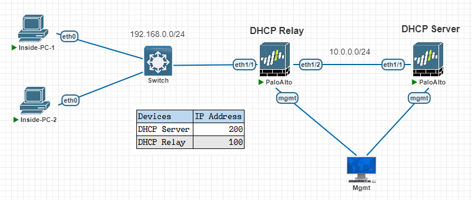
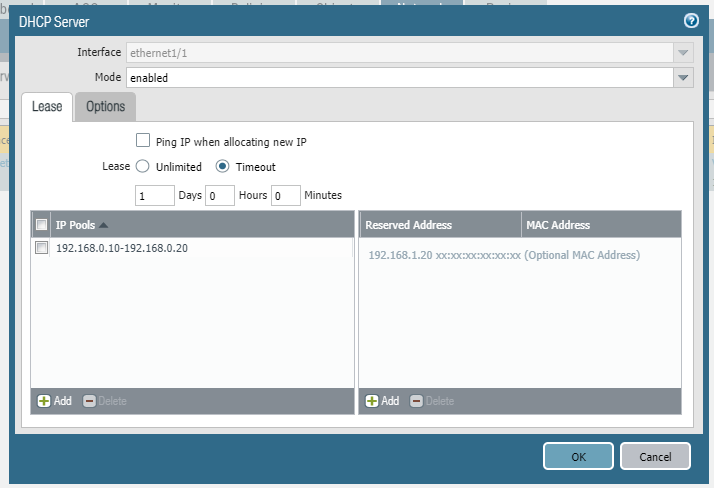
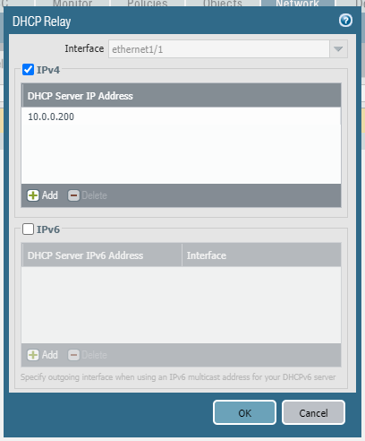

# DHCP Server and Relay on Palo Alto

---
Lab for
- DHCP Server
- DHCP Relay

Task
1. [Initial Config of DHCP Server](#1-initial-config-of-dhcp-server)
    - 1.1. Create Management profile
    - 1.2. Create zones (inside)
    - 1.3. Configure interfaces (zone, default VR, IP, if-type)
    - 1.4. Create route to INSIDE
2. [Initial Config of DHCP Relay](#2-initial-config-of-dhcp-relay)
    - 1.1. Create Management profile
    - 1.2. Create zones (inside)
    - 1.3. Configure interfaces (zone, default VR, IP, if-type)
3. [DHCP Server Config](#3-dhcp-config)
4. [DHCP Relay Config](#4-dhcp-relay-config)
5. [Verification](#5-verification)
---
#### 1. Initial Config of DHCP Server
- 1.1. Create Management profile
	```sh
	network > network profiles > interface mgmt > add >
		name = `ping`
		network services = `ping`
	```
- 1.2. Create zones (inside)
	```sh
	network > zones > add > 
		name = `Inside`
		type = `layer3` 
    ```
- 1.3. Configure interfaces (zone, default VR, IP, inter-type)
	```sh
	network > interface > ethernet > ethernet1/1 >
		interface type = `Layer3`
		config
			virtual router = `default`
			security zone = `Inside`
		IPv4
			type = `static`
			IP = `10.0.0.200/24`
		advanced
			other info
				management profile = `ping`
	```
- 1.4. Create route to INSIDE
    ```sh
    network > virtual routers > default > static routes > add >
        name = `ROUTE-TO-INSIDE`
        destination = `192.168.0.0/24`
        interface = `ethernet1/1`
        next hop = `10.0.0.100`
    ```
#### 2. Initial Config of DHCP Relay
- 2.1. Create Management profile
	```sh
	network > network profiles > interface mgmt > add >
		name = `ping`
		network services = `ping`
	```
- 2.2. Create zones (inside)
	```sh
	network > zones > add > 
		name = `Inside`
		type = `layer3` 
    ```
- 2.3. Configure interfaces (zone, default VR, IP, inter-type)
	```sh
	network > interface > ethernet > ethernet1/1 >
		interface type = `Layer3`
		config
			virtual router = `default`
			security zone = `Inside`
		IPv4
			type = `static`
			IP = `192.168.0.100/24`
		advanced
			other info
				management profile = `ping`

	network > interface > ethernet > ethernet1/2 >
		interface type = `Layer3`
		config
			virtual router = `default`
			security zone = `Inside`
		IPv4
			type = `static`
			IP = `10.0.0.100/24`
		advanced
			other info
				management profile = `ping`
    ```

#### 3. DHCP Config
```sh
network > dhcp > dhcp server > add >
    interface = `ethernet1/1`
    mode = `enabled`
    lease >
        timeout = 1 days
        add > `192.168.0.10-192.168.0.20`
    options >
        gateway = `192.168.0.100`
        subnet mask = `255.255.255.0`
        primary dns = `8.8.8.8`
        secondary dns = `8.8.4.4`
```

#### 4. DHCP Relay Config
```sh
network > dhcp > dhcp relay > add >
    interface = `ethernet1/1`
    IPv4 = `enable`
    dhcp server IP address = `10.0.0.200`
```

#### 5. Verification

	```sh
	admin@PA-VM> show dhcp server lease interface ethernet1/1 

	interface: "ethernet1/1" id: 16
	Allocated IPs: 1, Total number of IPs in pool: 11. 9.1% used
`	ip              mac                hostname                         state      duration    lease_time            
	192.168.0.10    00:50:79:66:68:17  VPCS1                            committed  86400       Sun Nov 17 02:06:44 2024
`
	```

---


