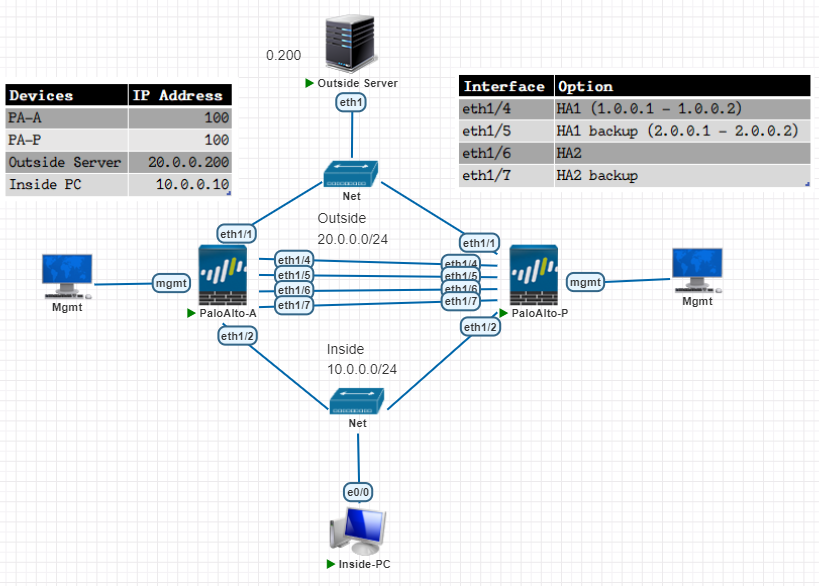
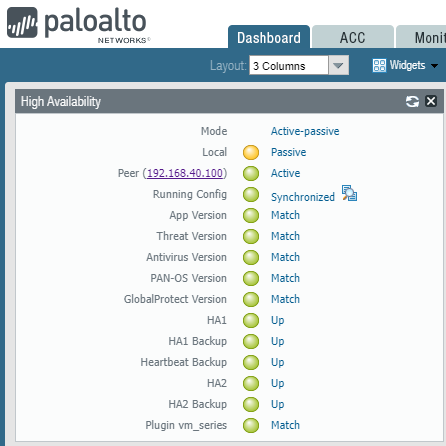

# High Availability

---
Lab for
- Palo Alto HA Lab

Task
1. [Configure Interfaces for HA Link](#1-configure-interfaces-for-ha-link)
2. [HA Config](#2-ha-config)
    - 2.1. HA setup
    - 2.2. Active/Passive Settings
    - 2.3. Election Settings
    - 2.4. Control Link (HA1) Config
    - 2.5. Control Link (HA1 backup) Config
    - 2.6. Data Link (HA2) Config
    - 2.7. Data Link (HA2 backup) Config
3. [NAT Config on PA-A](#3-nat-config-on-pa-a)
    - 3.1. Create Manangement Profile
    - 3.2. Create Zones
    - 3.3. Configure Interface
    - 3.4. Setup Default Route
    - 3.5. Create NAT policy
    - 3.6. Create Security policy
4. Verify
---
#### 1. Configure Interfaces for HA Link
```sh
network > interfaces > ethernet > 'ethernet1/4' >
    type: 'HA'
network > interfaces > ethernet > 'ethernet1/5' >
    type: 'HA'
network > interfaces > ethernet > 'ethernet1/6' >
    type: 'HA'
network > interfaces > ethernet > 'ethernet1/7' >
    type: 'HA'
```
#### 2. HA Config
- 2.1. HA setup
    ```sh
    device > high availability > general > 'setup' >
        enable HA: 'enable'
        group ID: '10'
        mode: 'Active Passive'
        enable config sync: 'enable'
        peer HA1 IP address: '1.0.0.2'
        backup peer HA1 IP address: '2.0.0.2'
    ```
- 2.2. Active/Passive Settings
    ```sh
    device > high availability > general > 'active/passive settings' >
        passive link state: 'auto'
    ```
- 2.3. Election Settings
    ```sh
    device > high availability > general > 'election settings' >
        device priority: '50'
        preemption: 'enable'
        heartbeat backup: 'enable'
    ```
- 2.4. Control Link (HA1) Config
    ```sh
    device > high availability > general > 'control link (HA1)' >
        port: 'ethernet1/4'
        IPv4/IPv6 address: '1.0.0.1'
        netmask: '255.255.255.0'
    ```
- 2.5. Control Link (HA1 backup) Config
    ```sh
    device > high availability > general > 'control link (HA1 backup)' >
        port: 'ethernet1/5'
        IPv4/IPv6 address: '2.0.0.1'
        netmask: '255.255.255.0'
    ```
- 2.6. Data Link (HA2) Config
    ```sh
    device > high availability > general > 'data link (HA2)' >
        enable session sync: 'enable'
        port: 'ethernet1/6'
        transport: 'ethernet'
    ```
- 2.7. Data Link (HA2 backup) Config
    ```sh
    device > high availability > general > 'data link (HA2 backup)' >
        port: 'ethernet1/7'
    ```
#### 3. NAT Config on PA-A
- 3.1. Create Manangement Profile
    ```sh
    network > network profiles > interface mgmt >
        name: 'PING'
        network services: 'ping'
    ```
- 3.2. Create Zones
    ```sh
    network > zones > add >
        name: 'INSIDE'
        type: 'layer3'

    network > zones > add >
        name: 'OUTSIDE'
        type: 'layer3'
    ```
- 3.3. Configure Interface
    ```sh
    network > interfaces > add >
        name: 'ethernet1/1'
        type: 'layer3'
        config > virtual router: 'default'
        config > security zone: 'OUTSIDE'
        IPv4: '20.0.0.100'
        adv > other info > mgmt profile: 'PING'
        
    network > interfaces > add >
        name: 'ethernet1/2'
        type: 'layer3'
        config > virtual router: 'default'
        config > security zone: 'INSIDE'
        IPv4: '10.0.0.100'
        adv > other info > mgmt profile: 'PING'
    ```
- 3.4. Setup Default Route
    ```sh
    network > virtual routers > default > static routes > add >
            name: 'DEFAULT-ROUTE'
            destination: '0.0.0.0/0'
            interface: 'ethernet1/1'
            next hop: '20.0.0.200'
    ```
- 3.5. Create NAT policy
    ```sh
    policies > NAT > add >
		general >
			name: 'NAT-RULE'
		original packet >
			src zone: 'INSIDE'
			dst zone: 'OUTSIDE'
			dst if: 'ethernet1/1'
			service: 'any'
		translate packet >
			tran type: 'DIPP'
			addr type: 'interface address'
			int: 'ethernet1/1'
			IP addr: '20.0.0.100/24'
    ```
- 3.6. Create Security policy
    ```sh
    policies > security > add >
		general > 
			name: 'IN-TO-OUT'
		source >
			source zone: 'INSIDE'
		destination >
			dst zone: 'OUTSIDE'
		action > 
			action: 'allow'
    ```
#### 4. Verify
