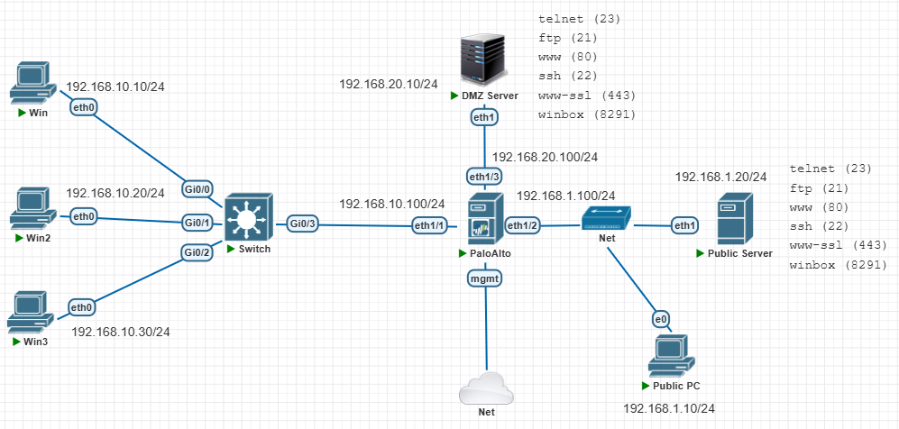
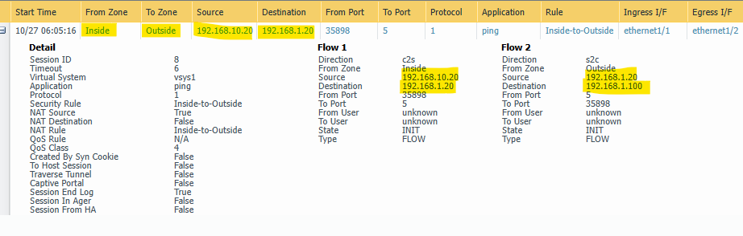
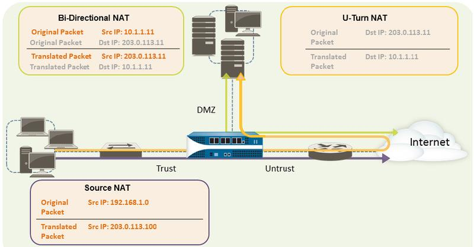

# NAT on Palo-Alto

---
Lab for
- NAT on Palo-Alto
- SNAT
- DNAT
- U-Turn NAT

Task
1. [Topology Setup](#1-topology-setup)
2. [SNAT with Dynamic IP and Port (PAT)](#2-snat-with-dynamic-ip-and-port-pat)
3. [SNAT with Dynamic IP](#3-snat-with-dynamic-ip)
4. [SNAT with Static IP](#4-snat-with-static-ip)
5. [DNAT (Static and Port Forwarding)](#5-dnat-static-and-port-forwarding)
6. [DNAT (Static and Port Translation)](#6-dnat-static-and-port-translation)
7. [U-Turn NAT](#7-u-turn-nat)
---
#### 1. Topology Setup
- 1.1. Create Zones for Inside, Outside, DMZ
    ```sh
    network > zones > add >
        name = `Outside`
        type = layer3

    network > zones > add >
        name = `Inside`
        type = layer3

    network > zones > add >
        name = `DMZ`
        type = layer3
    ```
- 1.2. Create Management Profile for ping service
    ```sh
    network > network profiles > interface mgmt >
        name = `ping`
        network services = `ping`
    ```
- 1.3. Create and Assign IP addresses
    ```sh
    network > interfaces > add >
        name = `ethernet1/1`
        type = `layer3`
        config > virtual router = `default`
        config > security zone = `Inside`
        IPv4 = `192.168.10.100`
        adv > other info > mgmt profile = `ping`
        
    network > interfaces > add >
        name = `ethernet1/2`
        type = `layer3`
        config > virtual router = `default`
        config > security zone = `Outside`
        IPv4 = `192.168.1.100`
        adv > other info > mgmt profile = `ping`
    
    network > interfaces > add >
        name = `ethernet1/3`
        type = `layer3`
        config > virtual router = `default`
        config > security zone = `DMZ`
        IPv4 = `192.168.20.100`
        adv > other info > mgmt profile = `ping`
    ```


- 1.4. Create Default Route
    ```sh
    network > virtual routers > default > static routes > add >
            name = `Default-Route`
            destination = `0.0.0.0/0`
            interface = `ethernet1/2`
            next hop = `192.168.1.20`
    ```
---
#### 2. SNAT with Dynamic IP and Port (PAT)
- 2.1. Create NAT Policy
    ```sh
    policies > NAT > add >
            general >
                    name = `Inside-to-Outside`
            original packet >
                    src zone = `Inside`
                    dst zone = `Outside`
                    dst if = `ethernet1/1`
                    service = `any`
                    src IP = `192.168.10.0/24`
            translate packet >
                    tran type = `DIPP`
                    addr type = `interface address`
                    int = `ethernet1/1`
                    IP addr = `192.168.100.100`
    ```

- 2.2. Create Security Policy
    ```sh
    policies > security > add >
            general > 
                    name = `Inside-to-Outside`
            source >
                    source zone = `Inside`
            destination >
                    dst zone = `Outside`
            action > 
                    action = `allow`
    ```
- 2.3. Verification <br>
    `> show running nat-policy` <br>
    `> show running global-ippool` <br>
    `> show session all` <br>
    `> clear session all` <br>
    `monitor > session browser` <br>

    ```sh
    admin@PA-VM> show running nat-policy
    
    "Inside-to-Outside; index: 1" {
            nat-type ipv4;
            from Inside;
            source 192.168.10.0/24;
            to Outside;
            to-interface ethernet1/2 ;
            destination any;
            service 0:any/any/any;
            translate-to "src: ethernet1/2 192.168.1.100 (dynamic-ip-and-port) (pool idx: 2)";
            terminal no;
    }
    ```
    ```sh
    admin@PA-VM> show running global-ippool 
    
    Idx  Type             From                             To              ToNum Ref. Cnt Mem Size Ratio Ready 
    ---- ---------------  -------------------------------- --------------- ----- -------- -------- ----- ------
    2    Dynamic IP/Port 192.168.10.0-192.168.10.255      192.168.1.100   1     1           20392     2 k1 /p1
    ```
    ```sh
    admin@PA-VM> show session all
    
    --------------------------------------------------------------------------------
    ID          Application    State   Type Flag  Src[Sport]/Zone/Proto (translated IP[Port])
    Vsys                                          Dst[Dport]/Zone (translated IP[Port])
    --------------------------------------------------------------------------------
    10           ping           ACTIVE  FLOW  NS   `192.168.10.20`[46395]/Inside/1  (`192.168.1.100`[46395])
    vsys1                                          192.168.1.20[1]/Outside  (192.168.1.20[1])
    12           ping           ACTIVE  FLOW  NS   192.168.10.20[46907]/Inside/1  (192.168.1.100[46907])
    vsys1                                          192.168.1.20[3]/Outside  (192.168.1.20[3])
    ```
    
---
#### 3. SNAT with Dynamic IP
- 3.1. Create NAT Policy
    ```sh
    policies > NAT > add >
        general >
            name = `Inside-to-Outside`
        original packet >
            src zone = `Inside`
            dst zone = `Outside`
            dst if = `ethernet1/1`
            service = `any`
            src IP = `192.168.10.0/24`
        translate packet >
            tran type = `Dynamic IP`
            tran addr = `192.168.1.110, 192.168.1.120`
    ```
- 3.2. Create Security Policy
    ```sh
    policies > security > add >
        general > 
            name = `Inside-to-Outside`
        source >
            source zone = `Inside`
        destination >
            dst zone = `Outside`
        action > 
            action = `allow`
    ```
- 3.3. Verification <br>
    `> show running nat-policy` <br>
    `> show running global-ippool` <br>
    `> show session all` <br>
    `> clear session all` <br>
    `monitor > session browser` <br>

    ```sh
    admin@PA-VM> show session all
    
    --------------------------------------------------------------------------------
    ID          Application    State   Type Flag  Src[Sport]/Zone/Proto (translated IP[Port])
    Vsys                                          Dst[Dport]/Zone (translated IP[Port])
    --------------------------------------------------------------------------------
    869          ping           ACTIVE  FLOW  NS   `192.168.10.20[56126]`/Inside/1  (`192.168.1.110[56126]`)
    vsys1                                          192.168.1.20[132]/Outside  (192.168.1.20[132])
    868          ping           ACTIVE  FLOW  NS   `192.168.10.30[55870]`/Inside/1  (`192.168.1.120[55870]`)
    vsys1                                          192.168.1.20[74]/Outside  (192.168.1.20[74])
    ```
---
#### 4. SNAT with Static IP
- 4.1. Create NAT Policy
    ```sh
    policies > NAT > add >
        general >
            name = `Inside-to-Outside`
        original packet >
            src zone = `Inside`
            dst zone = `Outside`
            dst if = `ethernet1/1`
            service = `any`
            src IP = `192.168.10.10`
        translate packet >
            tran type = `Static IP`
            tran addr = `192.168.1.150`
    ```
- 4.2. Create Security Policy
    ```sh
    policies > security > add >
        general > 
            name = `Inside-to-Outside`
        source >
            source zone = `Inside`
        destination >
            dst zone = `Outside`
        action > 
            action = `allow`
    ```
- 4.3. Verification <br>
    `> show running nat-policy` <br>
    `> show running global-ippool` <br>
    `> show session all` <br>
    `> clear session all` <br>
    `monitor > session browser` <br>

    ```sh
    admin@PA-VM> show session all
    
    --------------------------------------------------------------------------------
    ID          Application    State   Type Flag  Src[Sport]/Zone/Proto (translated IP[Port])
    Vsys                                          Dst[Dport]/Zone (translated IP[Port])
    --------------------------------------------------------------------------------
    953          ping           ACTIVE  FLOW  NS   `192.168.10.10`[1]/Inside/1  (`192.168.1.150`[1])
    vsys1                                          192.168.1.20[369]/Outside  (192.168.1.20[369])
    ```
---
#### 5. DNAT (Static and Port Forwarding)
- 5.1. Create NAT policy
    ```sh
    policies > NAT > add >
        general >
            name = `Outside-to-DMZ`
        original packet >
            src zone = `Outside`
            dst zone = `Outside`
            dst if = `ethernet1/2`
            service = `any`
            src IP = `any`
            dst IP = `192.168.1.100`
        translate packet > destination address translation >
            tran type = `Static IP`
            tran addr = `192.168.20.10`
    ```
- 5.2. Create Security policy
    ```sh
    policies > security > add >
        general > 
            name = `Outside-to-DMZ`
        source >
            source zone = `Outside`
        destination >
            dst zone = `DMZ`
        action > 
            action = `allow`
    ```
- 5.3. Verification <br>
    `> show running nat-policy` <br>
    `> show running global-ippool` <br>
    `> show session all` <br>
    `> clear session all` <br>
    `monitor > session browser` <br>

    ```sh
    admin@PA-VM> show session all
    
    --------------------------------------------------------------------------------
    ID          Application    State   Type Flag  Src[Sport]/Zone/Proto (translated IP[Port])
    Vsys                                          Dst[Dport]/Zone (translated IP[Port])
    --------------------------------------------------------------------------------
    50           ssl            ACTIVE  FLOW  ND   192.168.1.10[1059]/Outside/6  (192.168.1.10[1059])
    vsys1                                          `192.168.1.100`[443]/DMZ  (`192.168.20.10`[443])
    52           ping           ACTIVE  FLOW  ND   192.168.1.10[1]/Outside/1  (192.168.1.10[1])
    vsys1                                          192.168.1.100[20]/DMZ  (192.168.20.10[20])
    ```
---
#### 6. DNAT (Static and Port Translation)
- 6.1. Create NAT policy
    ```sh
    policies > NAT > add >
        general >
            name = `Outside-to-DMZ`
        original packet >
            src zone = `Outside`
            dst zone = `Outside`
            dst if = `ethernet1/2`
            service = `service-http`
            src IP = `any`
            dst IP = `192.168.1.100`
        translate packet > destination address translation >
            tran type = `Static IP`
            tran addr = `192.168.20.10`
            tran port = `8080`
    ```
- 6.2. Create Security Policy
    ```sh
    policies > security > add >
        general > 
            name = `Outside-to-DMZ`
        source >
            source zone = `Outside`
        destination >
            dst zone = `DMZ`
        action > 
            action = `allow`
    ```
- 6.3. Verification <br>
    `> show running nat-policy` <br>
    `> show running global-ippool` <br>
    `> show session all` <br>
    `> clear session all` <br>
    `monitor > session browser` <br>

    ```sh
    admin@PA-VM> show session all
    
    --------------------------------------------------------------------------------
    ID          Application    State   Type Flag  Src[Sport]/Zone/Proto (translated IP[Port])
    Vsys                                          Dst[Dport]/Zone (translated IP[Port])
    --------------------------------------------------------------------------------
    187          ssl            ACTIVE  FLOW  ND   192.168.1.10[1161]/Outside/6  (192.168.1.10[1161])
    vsys1                                          `192.168.1.100[443]`/DMZ  (`192.168.20.10[443]`)
    192          web-browsing   ACTIVE  FLOW  ND   192.168.1.10[1166]/Outside/6  (192.168.1.10[1166])
    vsys1                                          `192.168.1.100[80]`/DMZ  (`192.168.20.10[8080]`)
    ```
---
#### 7. U-Turn NAT

- 7.1. Create NAT policy
    ```sh
    policies > NAT > add >
        general >
            name = `U-Turn-NAT`
        original packet >
            src zone = `Inside`
            dst zone = `Outside`
            dst if = `ethernet1/2`
            service = `any`
            src IP = `192.168.10.0/24`
            dst IP = `192.168.1.100`
        translate packet > source address translation >
            tran type = `dynamic IP and Port`
            address type = `interface address`
            interface = `ethernet1/3`
            tran addr = `192.168.20.100`
        translate packet > destination address translation >
            tran type = `Static IP`
            tran addr = `192.168.20.10`
    ```
- 7.2. Create Security Policy
    ```sh
    policies > security > add >
        general > 
            name = `Inside-to-DMZ`
        source >
            source zone = `Inside`
        destination >
            dst zone = `DMZ`
        action > 
            action = `allow`
    ```
- 7.3. Verification <br>
    `> show running nat-policy` <br>
    `> show running global-ippool` <br>
    `> show session all` <br>
    `> clear session all` <br>
    `monitor > session browser` <br>

    ```sh
    admin@PA-VM> show session all
    
    --------------------------------------------------------------------------------
    ID          Application    State   Type Flag  Src[Sport]/Zone/Proto (translated IP[Port])
    Vsys                                          Dst[Dport]/Zone (translated IP[Port])
    --------------------------------------------------------------------------------
    344          web-browsing   ACTIVE  FLOW  NB   `192.168.10.10`[1222]/Inside/6  (`192.168.20.100`[54828])
    vsys1                                          `192.168.1.100`[80]/DMZ  (`192.168.20.10`[80])
    343          ssl            ACTIVE  FLOW  NB   192.168.10.10[1221]/Inside/6  (192.168.20.100[27845])
    vsys1                                          192.168.1.100[443]/DMZ  (192.168.20.10[443])
    ```