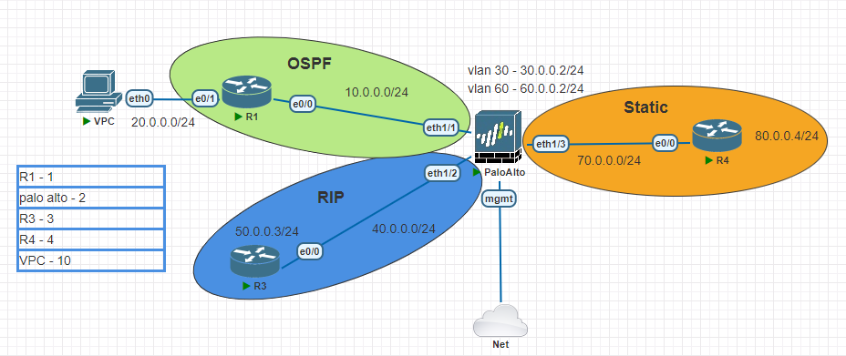

# Routing on Palo-Alto

---
Lab for
- Routing on Palo-Alto
- Zone Creation
- Vlan Creation
- Static Route
- RIP
- OSPF
- Redistribution

Task
1. [Initial Config](#1-initial-config)
	- 1.1. Create Management profile
	- 1.2. Create zone "Inside"
	- 1.3. Create vlan "vlan.30 and vlan.60"
	- 1.4. Assign IP address to ethernet 1/1, 1/2, 1/3
	- 1.5. Assign IP address to vlan.30 and vlan.60
2. [Virtual Router Config](#2-virtual-router-config)
	- 2.1. Static Route
	- 2.2. OSPF Route and Authentication
	- 2.3. RIP Route and Authentication
3. [Redistribution](#3-redistribution)
	- 3.1. Create Redistribution profile for RIP
	- 3.2. Create Redistribution profile for OSPF
	- 3.3. Create Redistribution profile for Static and Connect
	- 3.4. Apply Redistribution profile to RIP
	- 3.5. Apply Redistribution profile to OSPF
4. [Verification](#4-verification)

---
#### 1. Initial Config
- 1.1. Create Management profile
	```py
	network > network profiles > interface mgmt >
		name = ping
		network services = ping
	```
- 1.2. Create zone "Inside"
	```py
	network > zones > add > 
		name = Inside
		type = layer3 
	```
- 1.3. Create vlan "vlan.30 and vlan.60"
	```py
	network > VLANs > add >
		name = vlan30
	```
- 1.4. Assign IP address to ethernet 1/1, 1/2, 1/3
	```py
	network > interface > ethernet > ethernet1/1 >
		interface type = Layer3
		config
			virtual router = default
			security zone = Inside
		IPv4
			type = static
			IP = 10.0.0.2/24
		advanced
			other info
				management profile = ping
	```
- 1.5. Assign IP address to vlan.30 and vlan.60
	```py
	network > vlans >
		internet name = vlan.30
		config
			vlan = vlan30
			virtual router = default
			security zone = Inside
		IPv4
			type = static
			IP = 30.0.0.2/24
		advanced
			other info
				management profile = ping
	```

#### 2. Virtual Router Config
- 2.1 Static Route
	```py
	network > virtual routers > default > static routes > add >
		name = route_to_R4
		destination = 80.0.0.0/24
		interface = ethernet1/3
		next hop = 70.0.0.4
	```

- 2.2 OSPF Route and Authentication
OSPF Config 
	```py
	network > virtual routers > default > OSPF > 
		enable = yes
		reject default route = yes
		router id = 0.0.0.2
		area > add
			area ID = 0.0.0.0
			type
				type = normal
			interface > add >
				interface = ethernet 1/1
				enable = yes
				
				interface = vlan.30
				enable = yes
	```
- OSPF Authentication (Palo Alto - Cisco)
	```py
	Cisco#
		interface Ethernet0/0
		ip address 10.0.0.1 255.255.255.0
		ip ospf authentication key-chain cisco
		
		key chain cisco
		key 1
		key-string OneTwo34
		cryptographic-algorithm md5
	```
	```py
	Palo Alto#
		Network > virtual routers > default > OSPF > Auth Profiles > Add >
			profile name = paloalto
			password type = md5
			key-ID = 1
			key = OneTwo34
			preferred = yes
		Network > virtual routers > default > OSPF > Areas > 0.0.0.0 > interface > ethernet1/1 > 
			Auth Profile = paloalto
	```
	
	
- 2.3 RIP Route and Authentication
RIP Config 
	```py
	network > virtual routers > default > RIP >
		enable = yes
		reject default route = yes
		interfaces > add > 
			interface = ethernet1/2
			enable = yes
			mode = normal
			
			interface = vlan.60
			enable = yes
			mode = normal
	```
- RIP Authentication
	```py
	Cisco#
		interface Ethernet0/0
		ip address 40.0.0.3 255.255.255.0
		ip rip authentication mode md5
		ip rip authentication key-chain cisco
		
		key chain cisco
		key 1
		key-string OneTwo34
		cryptographic-algorithm md5
	```
	```py
	Palo Alto#
		Network > virtual routers > default > RIP > Auth Profiles > Add >
			profile name = paloalto
			password type = md5
			key-ID = 1
			key = OneTwo34
			preferred = yes
		Network > virtual routers > default > RIP > interface > ethernet1/2 > 
			Auth Profile = paloalto
	```

#### 3. Redistribution
- 3.1. Create Redistribution profile for RIP
	```py
	network > virtual routers > default > redistribution profile > add > 
		name = rip
		priority = 1
		general filter > source type = rip
	```
- 3.2. Create Redistribution profile for OSPF
	```py
	network > virtual routers > default > redistribution profile > add > 
		name = ospf
		priority = 1
		general filter > source type = ospf
	```
- 3.3. Create Redistribution profile for Static and Connect
	```py
	network > virtual routers > default > redistribution profile > add > 
		name = Static
		priority = 1
		general filter > source type = static, connect
	```
- 3.4. Apply Redistribution profile to RIP
	```py
	network > virtual routers > default > rip > export rules > 
		add > ospf
		add > static
	```
- 3.5. Apply Redistribution profile to OSPF
	```py
	network > virtual routers > default > ospf > export rules > 
		add > name = rip
		add > name = static
	```

		
#### 4. Verification
`Network > Virtual Routers > More Runtime Stats` <br>
`> show routing route` <br>
`> show routing protocol ospf summary` <br>
`> ping source 192.168.78.100 host 1.1.1.1` <br>
`> show routing protocol rip peer` <br>
`> show routing protocol rip summary` <br>
`> ping source 192.168.78.100 host 1.1.1.1` <br>
`> show routing protocol rip database`