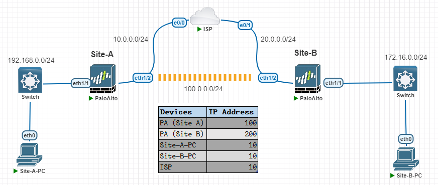
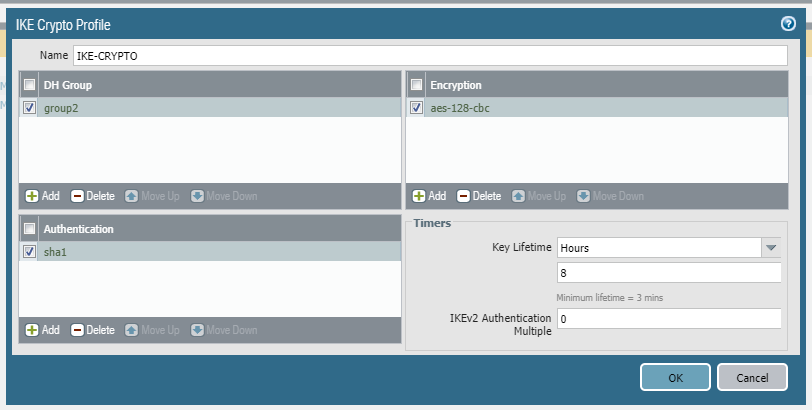
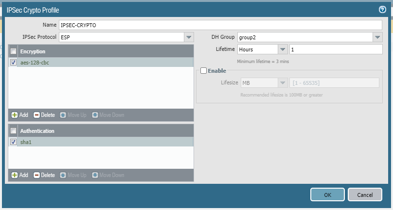
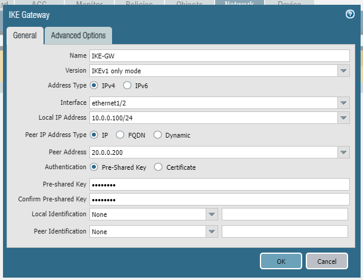
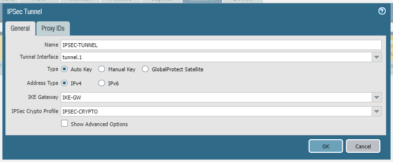
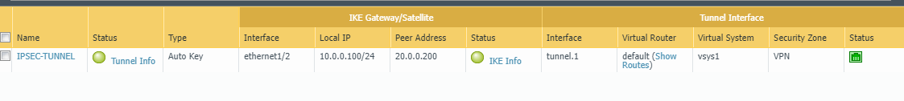
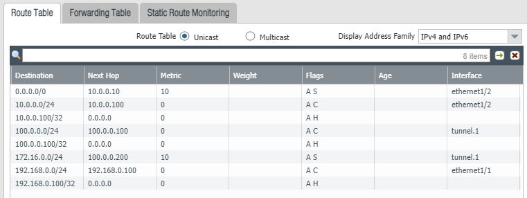

# IPsec VPN

---
Lab for
- IPsec config

Task
1. [Initial Config (Site-A)](#1-initial-config-site-a)
    - 1.1. Create Zones (INSIDE, OUTSIDE, VPN)
    - 1.2. Configure Interface (e1/1, e1/2, tunnel)
    - 1.3. Configure Route (default, tunnel)
    - 1.4. Security Policy (allow-all)
2. [Initial Config (Site-B)](#2-initial-config-site-b)
    - 2.1. Create Zones (INSIDE, OUTSIDE, VPN)
    - 2.2. Configure Interface (e1/1, e1/2, tunnel)
    - 2.3. Configure Route (default, tunnel)
    - 2.4. Security Policy (allow-all)
3. [IPsec Config (Site-A)](#3-ipsec-config-site-a)
    - 3.1. IKE Crypto Profile
    - 3.2. IPsec Crypto Profile
    - 3.3. IKE Gateways
    - 3.4. IPsec Tunnel
4. [IPsec Config (Site-B)](#4-ipsec-config-site-b)
    - 4.1. IKE Crypto Profile
    - 4.2. IPsec Crypto Profile
    - 4.3. IKE Gateways
    - 4.4. IPsec Tunnel
---
#### 1. Initial Config (Site-A)
- 1.1. Create Zones (INSIDE, OUTSIDE, VPN)
    ```sh
    network > zones > add >
        name: 'INSIDE'
        type: 'layer3'

        name: 'OUTSIDE'
        type: 'layer3'

        name: 'VPN'
        type: 'layer3'
    ```
- 1.2. Configure Interface (e1/1, e1/2, tunnel)
    ```sh
    network > interfaces > ethernet > 'ethernet1/1'
        type: 'layer3'
        config / virtual router: 'default'
        config / security zone: 'INSIDE'
        ipv4: '192.168.0.100/24'
        advanced / mgmt profile: 'PING'

    network > interfaces > ethernet > 'ethernet1/2'
        type: 'layer3'
        config / virtual router: 'default'
        config / security zone: 'OUTSIDE'
        ipv4: '10.0.0.100/24'
        advanced / mgmt profile: 'PING'

    network > interfaces > tunnel > add >
        name: 'tunnel.1'
        config / virtual router: 'default'
        config / security zone: 'VPN'
        ipv4: '100.0.0.100/24'
        advanced / mgmt profile: 'PING'
    ```
- 1.3. Configure Route (default, tunnel)
    ```sh
    network > virtual routers > default > static routes > add >
        name: 'DEFAULT-ROUTE'
        destination: '0.0.0.0/0'
        interface: 'ethernet1/2'
        next hop: '10.0.0.10'

        name: 'TUNNEL-ROUTE'
        destination: '172.16.0.0/24'
        interface: 'tunnel.1'
        next hop: '100.0.0.200'
    ```
- 1.4. Security Policy (allow-all)
    ```sh
    policies > security > add >
        general / name: 'ALLOW-ALL'
        source / source zone: 'INSIDE', 'OUTSIDE', 'VPN'
        destination / destination zone: 'INSIDE', 'OUTSIDE', 'VPN'
        actions / action: 'allow'
    ```
#### 2. Initial Config (Site-B)
- 2.1. Create Zones (INSIDE, OUTSIDE, VPN)
    ```sh
    network > zones > add >
        name: 'INSIDE'
        type: 'layer3'

        name: 'OUTSIDE'
        type: 'layer3'

        name: 'VPN'
        type: 'layer3'
    ```
- 2.2. Configure Interface (e1/1, e1/2, tunnel)
    ```sh
    network > interfaces > ethernet > 'ethernet1/1'
        type: 'layer3'
        config / virtual router: 'default'
        config / security zone: 'INSIDE'
        ipv4: '172.16.0.100/24'
        advanced / mgmt profile: 'PING'

    network > interfaces > ethernet > 'ethernet1/2'
        type: 'layer3'
        config / virtual router: 'default'
        config / security zone: 'OUTSIDE'
        ipv4: '20.0.0.100/24'
        advanced / mgmt profile: 'PING'

    network > interfaces > tunnel > add >
        name: 'tunnel.1'
        config / virtual router: 'default'
        config / security zone: 'VPN'
        ipv4: '100.0.0.200/24'
        advanced / mgmt profile: 'PING'
    ```
- 2.3. Configure Route (default, tunnel)
    ```sh
    network > virtual routers > default > static routes > add >
        name: 'DEFAULT-ROUTE'
        destination: '0.0.0.0/0'
        interface: 'ethernet1/2'
        next hop: '20.0.0.10'

        name: 'TUNNEL-ROUTE'
        destination: '192.168.0.0/24'
        interface: 'tunnel.1'
        next hop: '100.0.0.100'
    ```
- 2.4. Security Policy (allow-all)
    ```sh
    policies > security > add >
        general / name: 'ALLOW-ALL'
        source / source zone: 'INSIDE', 'OUTSIDE', 'VPN'
        destination / destination zone: 'INSIDE', 'OUTSIDE', 'VPN'
        actions / action: 'allow'
    ```
#### 3. IPsec Config (Site-A)
- 3.1. IKE Crypto Profile
    ```sh
    network > network profiles > 'IKE Crypto' > add >
        name: 'IKE-CRYPTO'
        dh-group: 'group2'
        authentication: 'sha1'
        encryption: 'aes-128-cbc'
    ```
    
- 3.2. IPsec Crypto Profile
    ```sh
    network > network profiles > 'IPsec Crypto' > add >
        name: 'IPSEC-CRYPTO'
        IPsec protocol: 'ESP'
        encryption: 'aes-128-cbc'
        authentication: 'sha1'
        dh-group: 'group2'
    ```
    
- 3.3. IKE Gateways
    ```sh
    network > network profiles > 'IKE Gateways' > add >
        general >
            name: 'IKE-GW'
            version: 'IKEv1 only mode'
            address type: 'IPv4'
            interface: 'ethernet1/2'
            local IP address: '10.0.0.100/24'
            peer address: '20.0.0.200'
            authentication: 'pre-shared key'
        advanced options >
            exchange mode: 'main'
            IKE cryto profile: 'IKE-CRYPTO'
    ```
    
- 3.4. IPsec Tunnel
    ```sh
    network > 'IPsec Tunnels' > add >
        name: 'IPSEC-TUNNEL'
        tunnel interface: 'tunnel.1'
        type: 'auto key'
        address type: 'IPv4'
        IKE gateway: 'IKE-GW'
        IPsec crypto profile: 'IPSEC-CRYPTO'
    ```
    
#### 4. IPsec Config (Site-B)
- 4.1. IKE Crypto Profile
    ```sh
    network > network profiles > 'IKE Crypto' > add >
        name: 'IKE-CRYPTO'
        dh-group: 'group2'
        authentication: 'sha1'
        encryption: 'aes-128-cbc'
    ```
- 4.2. IPsec Crypto Profile
    ```sh
    network > network profiles > 'IPsec Crypto' > add >
        name: 'IPSEC-CRYPTO'
        IPsec protocol: 'ESP'
        encryption: 'aes-128-cbc'
        authentication: 'sha1'
        dh-group: 'group2'
    ```
- 4.3. IKE Gateways
    ```sh
    network > network profiles > 'IKE Gateways' > add >
        general >
            name: 'IKE-GW'
            version: 'IKEv1 only mode'
            address type: 'IPv4'
            interface: 'ethernet1/2'
            local IP address: '20.0.0.200/24'
            peer address: '10.0.0.100'
            authentication: 'pre-shared key'
        advanced options >
            exchange mode: 'main'
            IKE cryto profile: 'IKE-CRYPTO'
    ```
- 4.4. IPsec Tunnel
    ```sh
    network > 'IPsec Tunnels' > add >
        name: 'IPSEC-TUNNEL'
        tunnel interface: 'tunnel.1'
        type: 'auto key'
        address type: 'IPv4'
        IKE gateway: 'IKE-GW'
        IPsec crypto profile: 'IPSEC-CRYPTO'
    ```
#### Verification
> network > IPsec tunnels >



> network > virtual routers > default > more runtime stats >

