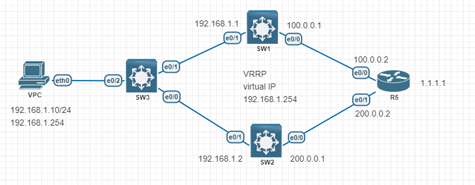

# VRRP

---
#### Lab for
- VRRP 

#### Task
1. Basic Configuration
2. Configure VRRP
---
#### 1. Basic Configuration
```
SW-1#
	int e0/0
	no switch
	ip add 100.0.0.1 255.255.255.0
	no shut

	int e0/1
	no swit
	ip add 192.168.1.1 255.255.255.0
	no shut

	ip routing
	ip route 0.0.0.0 0.0.0.0 100.0.0.2
```
```
SW-2#
	int e0/0
	no switch
	ip add 200.0.0.1 255.255.255.0
	no shut

	int e0/1
	no swit
	ip add 192.168.1.2 255.255.255.0
	no shut

	ip routing
	ip route 0.0.0.0 0.0.0.0 200.0.0.2
```
#### 2. Configure VRRP
```
SW-1# 
	int e0/1
	vrrp 10 ip 192.168.1.254
	vrrp 10 preempt
	vrrp 10 priority 120
	vrrp 10 authentication text MyLab.90
```
```
SW-2#
	int e0/1
	vrrp 10 ip 192.168.1.254
	vrrp 10 authentication text MyLab.90
```
#### 3. Verification
```
SW1# sh vrrp

Ethernet0/1 - Group 10 
  State is Master  
  Virtual IP address is 192.168.1.254
  Virtual MAC address is 0000.5e00.010a
  Advertisement interval is 1.000 sec
  Preemption enabled
  Priority is 120 
  Authentication is enabled
  Master Router is 192.168.1.1 (local), priority is 120 
  Master Advertisement interval is 1.000 sec
  Master Down interval is 3.531 sec
```
```
SW2# sh vrrp

Ethernet0/1 - Group 10 
  State is Backup  
  Virtual IP address is 192.168.1.254
  Virtual MAC address is 0000.5e00.010a
  Advertisement interval is 1.000 sec
  Preemption enabled
  Priority is 100 
  Authentication is enabled
  Master Router is 192.168.1.1, priority is 120 
  Master Advertisement interval is 1.000 sec
  Master Down interval is 3.609 sec (expires in 3.037 sec)
```
